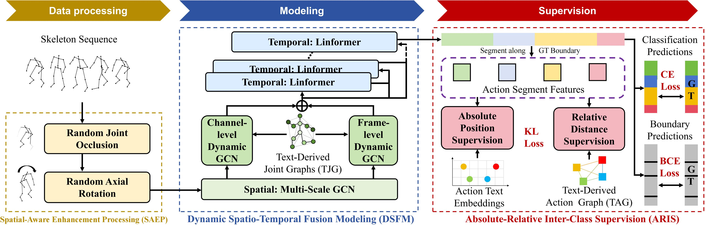

# <p align=center> Text-Derived Relational Graph-Enhanced Network <br> for Skeleton-Based Action Segmentation</p>

> **Authors:**
> Haoyu Ji,
> Bowen Chen,
> Weihong Ren,
> Wenze Huang,
> Zhihao Yang,
> Zhiyong Wang,
> Honghai Liu*
> (Corresponding author)


> **Abstract:** *Skeleton-based Temporal Action Segmentation (STAS) aims to segment and recognize various actions from long, untrimmed sequences of human skeletal movements. Current STAS methods typically employ spatio-temporal modeling to establish dependencies among joints as well as frames, and utilize one-hot encoding with cross-entropy loss for frame-wise classification supervision. However, these methods overlook the intrinsic correlations among joints and actions within skeletal features, leading to a limited understanding of human movements. To address this, we propose a Text-Derived Relational Graph-Enhanced Network (TRG-Net) that leverages prior graphs generated by Large Language Models (LLM) to enhance both modeling and supervision. For modeling, the Dynamic Spatio-Temporal Fusion Modeling (DSFM) method incorporates Text-Derived Joint Graphs (TJG) with channel- and frame-level dynamic adaptation to effectively model spatial relations, while integrating spatio-temporal core features during temporal modeling. For supervision, the Absolute-Relative Inter-Class Supervision (ARIS) method employs contrastive learning between action features and text embeddings to regularize the absolute class distributions, and utilizes Text-Derived Action Graphs (TAG) to capture the relative inter-class relationships among action features. Additionally, we propose a Spatial-Aware Enhancement Processing (SAEP) method, which incorporates random joint occlusion and axial rotation to enhance spatial generalization. Performance evaluations on four public datasets demonstrate that TRG-Net achieves state-of-the-art results.* 

<p align="center">
     <br />
    <em> 
    Figure 1: Overview of the TRG-Net.
    </em>
</p>


## Introduction
The PyTorch code serves as the implementation of the paper: "Text-Derived Relational Graph-Enhanced Network for Skeleton-Based Action Segmentation".
> * Our proposed TRG-Net leverages leverages prior graphs and embeddings generated by BERT to enhance both modeling and supervision.
> * In addition, we propose two data augmentation methods, random joint occlusion and axial rotation, to enhance spatial generalization ability.
> * This implementation code encompasses both training `train.py` and evaluation `evaluation.py` procedures.
> * A single GPU (NVIDIA RTX 3090) can perform all the experiments.

## Enviroment
Pytorch == `1.10.1+cu111`, 
torchvision == `0.11.2`, 
python == `3.8.13`, 
CUDA==`11.4`

### Enviroment Setup
Within the newly instantiated virtual environment, execute the following command to install all dependencies listed in the `requirements.txt` file.

``` python
pip install -r requirements.txt
```

## Datasets
All datasets can be downloaded from
[GoogleDrive](https://drive.google.com/drive/folders/1IwiDpf8D2RLzTbF8IB6D6UxCjXmY6J4s?usp=sharing).

**Note**：This cloud drive contains most of the skeleton-based temporal action segmentation datasets, including **PKU-MMD (X-sub)**, **PKU-MMD (X-view)**, **LARa**, and **MCFS-130** datasets.


## Preparation

Orgnize the folder in the following structure (**Note**: please check it carefully):

```
|-- config/
|   |-- MCFS-130/
|   |   -- config.yaml
|-- csv/
|-- datasets/
|   |-- LARA/
|   |   |-- features/
|   |   |-- gt_arr/
|   |   |-- gt_boundary_arr/
|   |   |-- splits/
|   |   |-- mapping.txt
|   |-- MCFS-130/
|   |-- PKU-subject/
|   |-- PKU-view/
|-- libs/
|-- pretrained_models
|   |-- MCFS-130/
|   |   |-- best_test_F1_0.5_model.prm
|-- result/
|-- text_embeddings/
|-- utils/
|-- train.py
|-- evaluate.py

```

- `config/`: Parameter configurations for each dataset.  
- `csv/`: Predefined data splits for each dataset.  
- `datasets/`: Raw dataset files.  
- `libs/`: Core model implementation code.  
- `pretrained_models/`: Trained models (results) on each dataset from this work.  
- `result/`: Output directory for training/evaluation results.  
- `text_embedding/`: BERT-generated embeddings for joint and action class text descriptions (per dataset).  
- `train.py` & `evaluate.py`: Main scripts for training and evaluation respectively.  

* The `result` folder and its contents will be automatically generated during code execution (`result` is the default storage path for results).
* Please download the corresponding four datasets and place them in the `datasets` folder. Alternatively, you may modify the `dataset_dir` parameter in the respective dataset's configuration file (e.g., `config/LARA/config.yaml`) to specify your dataset path.


## Get Started

### Training

To train our model on different datasets, use the following command:

```shell
python train.py --dataset PKU-subject --cuda 0
```

Here, `--dataset` can be one of the following: LARA, MCFS-130, PKU-subject, or PKU-view. 
`--cuda` specifies the ID number of the GPU to be used for training. 
Additionally, you can use `--result_path` to specify the output path, which defaults to `./result`.

If you wish to modify other parameters, please update the corresponding dataset's configuration file (e.g., `config/PKU-subject/config.yaml`).


### Evaluation

To evaluate the performance of the results obtained after running the training:

```shell
python evaluate.py --dataset PKU-subject --cuda 0
```

Here, `--dataset` and `--cuda` have the same meaning as in the training command. 
Note that if you specify `--result_path` for evaluation, it should match the `--result_path` used in training to ensure the correct trained model parameters are loaded.

Additionally, we provide pretrained models in `pretrained_models/` for all benchmarked datasets. To evaluate our reported results directly, specify the model path via `--model` parameter:

```shell
python evaluate.py --dataset PKU-subject --cuda 0 --model pretrained_models/PKU-subject/best_test_F1_0.5_model.prm
```


## Acknowledgement
The TRG-Net model and code are built upon [DeST](https://github.com/lyhisme/dest) and [LaSA](https://github.com/HaoyuJi/LaSA). 
The joint and action description text embeddings are generated using [BERT](https://github.com/google-research/bert).
Our experiments were conducted on four publicly available datasets: [PKU-MMD (X-sub)](https://www.icst.pku.edu.cn/struct/Projects/PKUMMD.html), [PKU-MMD (X-view)](https://www.icst.pku.edu.cn/struct/Projects/PKUMMD.html), [LARa](https://zenodo.org/records/3862782), and [MCFS-130](https://shenglanliu.github.io/mcfs-dataset/).

We sincerely thank the authors for openly sharing their code and datasets, which made this research possible.

## Citation
If this code is useful in your research we would kindly ask you to cite our paper.
```
@article{ji2025text,
  title={Text-Derived Relational Graph-Enhanced Network for Skeleton-Based Action Segmentation},
  author={Ji, Haoyu and Chen, Bowen and Ren, Weihong and Huang, Wenze and Yang, Zhihao and Wang, Zhiyong and Liu, Honghai},
  journal={arXiv preprint arXiv:2503.15126},
  year={2025}
}
```

## License
This repository is released under the [MIT](https://choosealicense.com/licenses/mit/) License.

## Contact
If you have any other questions, please email jihaoyu1224@gmail.com  and we typically respond within a few days.

